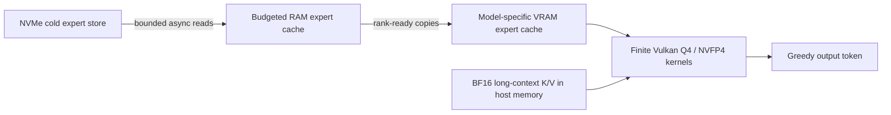

<p align="center">
  
</p>

<p align="center">
  
  
  
  
</p>

XTLLM (eXpert-Tier LLM) is an experimental, text-only Vulkan inference engine for
running very large mixture-of-experts models on consumer AMD GPUs. It keeps a
model-specific working set in VRAM, a budgeted expert tier in system RAM, and
the cold remainder on NVMe—while long-context K/V state lives in explicitly
accounted host memory.

It preserves the proven short-context backends and adds bounded long-context
execution for Qwen3.5, DeepSeek V4, Qwen3.6, and Nemotron 3 Nano. The unified
launcher also ships the retained model-specific Vulkan paths for Qwen3.8 Flash
Next, Qwen3-Coder-Next, and LongCat Flash Lite Sparse. Model weights are
**not** included.

> **Status:** Windows/RDNA2 research preview. Greedy text generation is working.
> The source is intentionally shape-specialized and is not a general model loader.

## Why this exists

Most runtimes treat a model larger than VRAM as an exceptional case. XTLLM
treats the hierarchy as the design:



- one executable auto-detects the converted model;
- live Vulkan memory-budget sizing chooses a safe model-specific expert cache;
- explicit `--ram-gib` and `--device-slots` overrides remain available;
- authoritative routing is preserved—no expert dropping, rerouting, or Q3;
- all submissions are finite and bounded; XTLLM never changes Windows TDR.

## GPU compatibility

Only the RX 6700 XT configuration is presently hardware-validated. The other
families below are **expected-compatible pending real validation** because they
provide the required AMD Vulkan feature set; this is not a claim that every
model or cache profile fits every card's VRAM.

| Architecture | Status | Expected card families and examples |
|---|---|---|
| RDNA2 | **Validated: RX 6700 XT 12GB**; other cards expected-compatible | Radeon RX 6600/6650 XT, 6700/6750 XT, 6800/XT, 6900/6950 XT; Radeon PRO W6000 series |
| RDNA3 | Expected-compatible, pending validation | Radeon RX 7600/XT, 7700 XT, 7800 XT, 7900 GRE/XT/XTX; Radeon PRO W7000 series |
| RDNA4 | Expected-compatible, pending validation | Radeon RX 9060 XT, 9070, and 9070 XT families |

Requirements are Vulkan 1.3, 64-lane subgroup support, sufficient device-local
VRAM for the selected model's fixed footprint, and current AMD drivers. Cards
with 8GB or less may require very small expert caches or may not fit a backend's
fixed allocations. AMD APUs/shared-memory graphics, pre-RDNA GPUs, Linux native
inference, and non-AMD Vulkan devices remain unvalidated in this snapshot.

XTLLM is independent software and is not affiliated with or endorsed by AMD.
AMD, Radeon, and RDNA are trademarks of Advanced Micro Devices, Inc.

## Supported model backends

| Model | Text parameters | Active/token | Routed experts | Runtime precision | Converted size |
|---|---:|---:|---:|---|---:|
| Qwen3.5-122B-A10B | 122.11B | 9.77B | 8 / 256 | Q4G64T; Q8 embed/head/router | 61.1 GiB |
| DeepSeek-V4-Flash-0731 | 284B | ~13B | 6 / 256 | Q4G64T experts/shared; Q8 global/router | ~141.2 GiB |
| Qwen3.6-35B-A3B | ~35B | ~3B | 8 / 256 | Q4G64T; Q8 embed/head/router | 17.62 GiB |
| NVIDIA Nemotron-3-Nano-30B-A3B | ~30B | ~3B | 6 / 128 | native E2M1 NVFP4/BF16-K16; Q8 global | 18.61 GiB |
| Qwen3.8-Flash-Next-FP8 | ~125B | ~6B | 10 / 512 | Q4G64T experts/shared; Q8 global/router; official FP8 PLE | 110.54 GiB |
| Qwen3-Coder-Next-FP8 | 79.67B | ~3.3B | 10 / 512 | Q4G64T experts/shared; Q8 embed/head/router | 39.73 GiB |
| LongCat-Flash-Lite-Sparse | ~68.5B | ~3B | 12 / 256 physical + 128 identity | Q4G64T experts; Q8 shared; BF16 n-gram rows | 78.35 GiB |

Vision and draft/MTP namespaces are not executed in these text-only numbers.

## Measured performance

RX 6700 XT 12GB, Ryzen 5 3600, NVMe SSD, Windows 10, greedy decode, Q4/NVFP4
quality. Short-context figures use 23 timed token transitions and prewarmed
budgeted caches. “System RAM” is a profile; the engine budget leaves OS headroom.

| Model | 16 GiB system | 24 GiB system | 32 GiB system | 64 GiB system | Primary limit |
|---|---:|---:|---:|---:|---|
| Qwen3.6-35B-A3B | 16.33 tok/s | 19.35 tok/s | 19.53 tok/s | 19.64 tok/s | GPU once warm |
| Nemotron-3-Nano-30B-A3B | 14.53 tok/s | 21.87 tok/s | 21.84 tok/s | 22.08 tok/s | GPU once warm |
| Qwen3.5-122B-A10B | 3.35 tok/s | 3.96 tok/s | 4.38 tok/s | 4.77 tok/s | expert acquisition/traffic |
| DeepSeek-V4-Flash-0731 | 1.99 tok/s | 2.60 tok/s | 2.77 tok/s | 2.70 tok/s | expert acquisition/traffic |

The three newer backends were validated separately with 63 timed greedy token
transitions. Their columns below are explicit model/expert RAM budgets rather
than installed-system profiles, so they should not be mixed with the table
above without preserving that distinction.

| Model | 16 GiB model RAM | 24 GiB model RAM | 32 GiB model RAM | Maximum retained profile | Peak VRAM | Primary limit |
|---|---:|---:|---:|---:|---:|---|
| Qwen3.8-Flash-Next-FP8 | — | — | — | **5.75 tok/s** at 53 GiB | 10.25 GiB | expert acquisition/H2D |
| Qwen3-Coder-Next-FP8 | **8.61 tok/s** | **9.18 tok/s** | **9.85 tok/s** | **10.55 tok/s** at 38.27 GiB/all experts | 10.60 GiB | H2D/shared compute once resident |
| LongCat-Flash-Lite-Sparse | **11.75–11.93 tok/s** | **12.42 tok/s** (all experts) | — | 24 GiB profile already holds all physical experts | 9.66 GiB | H2D/shared compute |

Qwen3.8 was originally measured using the installed-system profiles above:
4.75 tok/s at a 12 GiB model budget, 5.03 at 20 GiB, 4.97 at 28 GiB, and
5.75 at 53 GiB. LongCat's faster all-Q4 shared-weight experiment was rejected
because it produced incorrect repetitive text; the table reports only the
coherent retained Q8-shared path.

### Projected effect of more VRAM

These are projections, not benchmarks on those GPUs. They use the 24 GiB
system-RAM profile and model the combined effect of the larger live Vulkan
memory budget, a larger model-specific expert cache, and the expected effective
kernel throughput of representative 16 GB and 24 GB GPUs.

| Model | 12 GB measured | 16 GB projected | 24 GB projected | Expert-cache capacity (16 / 24 GB) |
|---|---:|---:|---:|---:|
| Qwen3.6-35B-A3B | 19.35 tok/s | **35–40 tok/s** | **55–65 tok/s** | 193 / 256 per layer |
| Nemotron-3-Nano-30B-A3B | 21.87 tok/s | **38–43 tok/s** | **75–90 tok/s** | 91 / 128 per MoE layer |
| Qwen3.5-122B-A10B | 3.96 tok/s | **5.8–6.8 tok/s** | **10–13 tok/s** | 44 / 75 per layer |
| DeepSeek-V4-Flash-0731 | 2.60 tok/s | **3.8–4.6 tok/s** | **8–10 tok/s** | 778 / 1,348 global records |

The projection assumes approximately **1.6× effective Vulkan-kernel throughput**
for the 16 GB configuration and **2.5×** for 24 GB, relative to the RX 6700 XT,
with safe expert-cache growth beyond today's validated widths. Actual results
depend on the specific GPU, driver, available VRAM, and route locality. See the
[assumptions and calculation](docs/VRAM_PROJECTIONS.md).

### Long-context decode

These measurements allocate and populate the requested history before timing a
small decode. Exact mode scans the full history; Fast is the fork's bounded
hierarchical candidate path. The smaller-model rows were measured in this
packaged build with the 12 GiB expert-RAM profile.

| Model | Context | Exact | Fast | Host K/V allocation |
|---|---:|---:|---:|---:|
| Qwen3.6-35B-A3B | 32K | **10.825 tok/s** | — | 0.625 GiB |
| Nemotron-3-Nano-30B-A3B | 64K | **6.556 tok/s** | — | 0.375 GiB |
| Qwen3.5-122B-A10B | 32K | 3.370 tok/s | 3.646 tok/s | 0.750 GiB |
| Qwen3.5-122B-A10B | 128K | 2.531 tok/s | 3.509 tok/s | 3.000 GiB |
| Qwen3.5-122B-A10B | 256K | 1.924 tok/s | 3.396 tok/s | 6.000 GiB |
| DeepSeek-V4-Flash-0731 | 128K | 1.106 tok/s | 1.270 tok/s | model-specific compressed history |
| DeepSeek-V4-Flash-0731 | ~1M | 0.977 tok/s | 2.023 tok/s | model-specific compressed history |

Fast long-context mode is an explicit speed/recall trade-off. Use `exact` when
full learned history is required. See [Benchmark methodology](docs/BENCHMARKS.md).

## Quick start — Windows

The release ZIP includes the native engine, compiled Vulkan shaders, model
converters, and launcher. You do **not** need CMake, a C++ compiler, or the
Vulkan SDK unless you want to modify XTLLM.

Prerequisites: Windows 10 22H2/11, an AMD Vulkan 1.3 driver, Python 3.11+, and
an NVMe drive large enough for both the official checkpoint and converted
runtime. Model weights are downloaded from their official publisher and are
never redistributed by XTLLM.

### 1. Install the launcher

Download and extract `xtllm-*-windows-x64.zip` from GitHub Releases,
open PowerShell in the extracted directory, then run:

```powershell
powershell -ExecutionPolicy Bypass -File .\scripts\install-windows.ps1
.\xtllm.cmd doctor
.\xtllm.cmd models
```

The installer creates a private `.venv` and installs only the Python packages
needed for downloading and one-time conversion. Inference remains the native
XTLLM Vulkan executable.

### 2. Download and convert one model

Choose a model alias and a drive with enough free space:

```powershell
.\xtllm.cmd setup qwen36 --model-root D:\XTLLM-Models
```

`setup` pins the official checkpoint revision, checks disk space, performs a
resumable Hugging Face download, runs the correct model-specific converter,
and verifies the resulting files. Conversion is one-time CPU/file work and can
take hours for the largest models. A setup interrupted during download or
expert conversion can be run again safely.

| Alias | Official checkpoint | Approx. checkpoint + runtime + peak scratch |
|---|---|---:|
| `qwen36` | `Qwen/Qwen3.6-35B-A3B` | 88 GiB |
| `nemotron` | `nvidia/NVIDIA-Nemotron-3-Nano-30B-A3B-NVFP4` | 40 GiB |
| `qwen122` | `Qwen/Qwen3.5-122B-A10B` | 300 GiB |
| `deepseek` | `deepseek-ai/DeepSeek-V4-Flash-0731` | 450 GiB |
| `qwen38` | `Qwen/Qwen3.8-Flash-Next-FP8` | 290 GiB |
| `qwencoder` | `Qwen/Qwen3-Coder-Next-FP8` | 120 GiB |
| `longcat` | `meituan-longcat/LongCat-Flash-Lite-Sparse` | 214 GiB |

Set `XTLLM_MODELS` once if you do not want to repeat `--model-root`:

```powershell
[Environment]::SetEnvironmentVariable('XTLLM_MODELS', 'D:\XTLLM-Models', 'User')
```

Open a new PowerShell window after setting it.

### 3. Chat or generate

```powershell
.\xtllm.cmd chat qwen36
```

This opens a private localhost chat page. For a one-shot prompt:

```powershell
.\xtllm.cmd run qwen36 "Explain why the sky appears blue." --tokens 128
```

Hardware and model type are auto-detected. The native backend selects its
proven model-specific cache policy from live system RAM and Vulkan VRAM budgets;
use `plan` to inspect that decision without running inference:

```powershell
.\xtllm.cmd plan qwen36
```

Advanced overrides such as `--ram-gib`, `--context-tokens`, and
`--device-slots` are optional. A clean expert-cache allocation OOM gets one
bounded retry at a smaller cache size.

### Build from source

Developers need the Vulkan SDK, CMake 3.25+, Ninja, Python 3.11+, and
LLVM-MinGW `clang++.exe`:

```powershell
git clone https://github.com/opktunme/XTLLM.git xtllm
cd xtllm
$env:PATH = "C:\llvm-mingw\bin;$env:PATH"
powershell -ExecutionPolicy Bypass -File .\scripts\build-windows.ps1
```

The auto-detecting engine, three shape-specialized native backends, and SPIR-V
shaders are written together under `build\`. The `xtllm` launcher chooses the
correct binary internally; users still run the same `xtllm run MODEL` or
`xtllm chat MODEL` command for every supported checkpoint.
Converted weights must not be committed; `.gitignore` excludes `.ovs`, `.ovx`,
and `.ovb` model assets. Keep each checkpoint's license and model-card terms.

## Linux

Python conversion works on Linux, but native inference in this snapshot is not
yet supported because the honest expert tier uses Windows-specific direct I/O
and memory APIs. The exact dependencies and bounded porting checklist are in
[docs/LINUX.md](docs/LINUX.md). Wine is not presented as a supported shortcut.

## Memory and context controls

```text
--ram-gib N          expert/model host-memory budget
--context-gib N      separately accounted host K/V budget
--context-tokens N   exact context capacity (overrides context-gib sizing)
--long-mode exact    full-history attention
--long-mode fast     bounded hierarchical long attention where supported
--long-mode auto     model-specific crossover
--device-slots N     exact expert-cache override
--no-prewarm         skip RAM-cache top-off
--plan               print selected hardware/memory policy without inference
```

The launcher rejects a requested RAM + context allocation that leaves less than
2 GiB currently available. K/V memory is BF16 for Qwen/Nemotron long paths.
Capacity is not the same as utilized context: a short chat remains fast even
when a large maximum window is reserved.

## Architecture notes

- **Qwen3.5/3.6:** hybrid Gated DeltaNet + full attention; only full-attention
  layers grow K/V state with context.
- **Nemotron:** Mamba/recurrent layers are fixed-state; six attention layers
  own the growing K/V cache.
- **DeepSeek:** MLA/mHC and compressed history use a model-specific indexing
  path; the generic Qwen cache layout is not forced onto it.
- **Qwen3.8 Flash Next:** four-stream gated residuals, hybrid DeltaNet/full
  attention, Top-10/512 MoE, and bounded reads from the official FP8 PLE table.
- **Qwen3-Coder-Next:** its own 48-layer hybrid layout and Top-10/512 expert
  cache, converted from the official FP8 checkpoint into the retained Q4 path.
- **LongCat Flash Lite Sparse:** dual attention/dense sublayers, MLA, physical
  and identity experts, and the checkpoint's BF16 n-gram embedding tables.
- **Experts:** RAM and VRAM policies stay model-specific. A single generic cache
  policy was deliberately rejected because it regressed proven paths.

## Safety boundaries

- no persistent or unbounded compute shaders;
- no GPU busy-spin waiting for CPU work;
- finite command-buffer rings and finite I/O waits;
- no TDR registry changes;
- no hidden filesystem cache as a claimed inference tier in budgeted modes;
- no Q3, expert dropping, substitution, pruning, or changed router decisions.

## 70B MoE projection

A hypothetical Q4 ~70B/A5B MoE is projected at **7–10 tok/s** on the 16 GiB
system profile and **10–14 tok/s** on the 24 GiB profile, reaching roughly
**12–17 tok/s** once its expert store is effectively warm. Assumptions,
traffic ranges, and uncertainty are documented in
[docs/PROJECTED_70B_MOE.md](docs/PROJECTED_70B_MOE.md).

## Contributing

Read [CONTRIBUTING.md](CONTRIBUTING.md), the safety invariants above, and
[SECURITY.md](SECURITY.md) before opening a pull request. Performance changes
need an end-to-end A/B, exact token IDs for the regression prompt, and memory/
traffic accounting—not only a kernel microbenchmark.

## License

Engine source: Apache-2.0. Model checkpoints and converted weights retain their
original licenses and are not redistributed by this repository.
